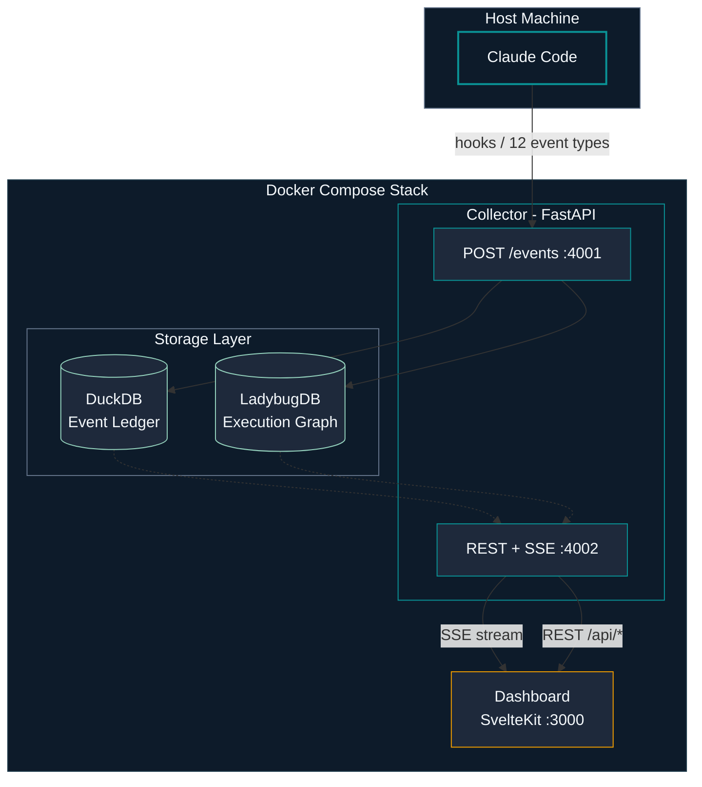
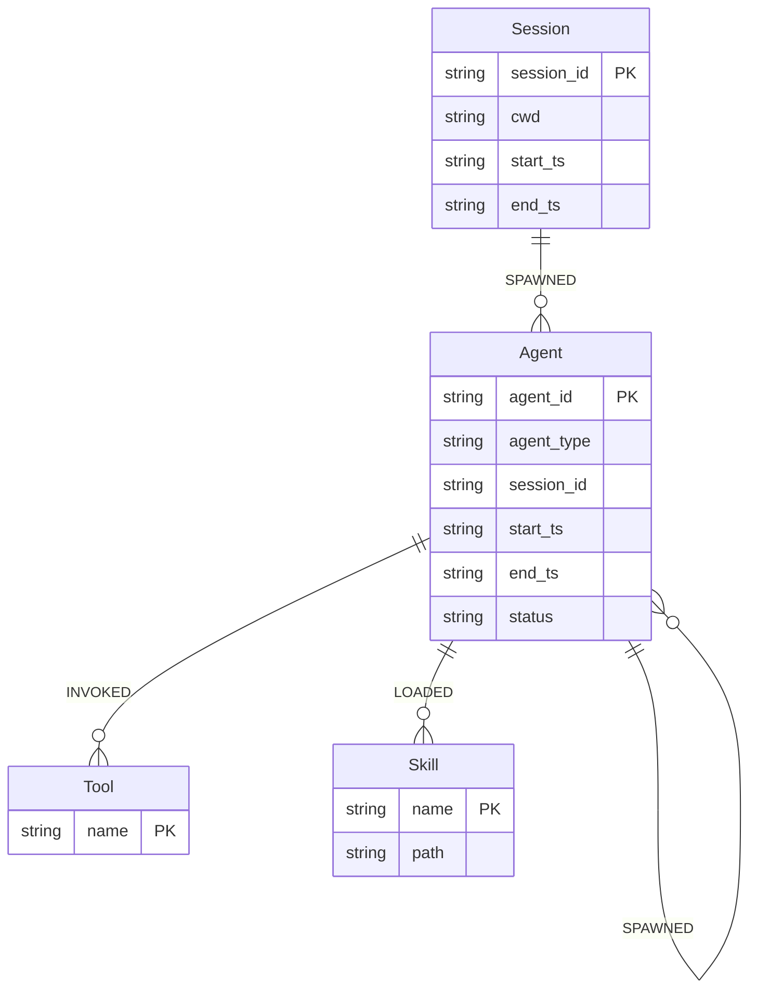

# CC Observer

**Real-time execution graph monitoring for Claude Code.**

[](docker-compose.yml)
[](collector/)
[](dashboard/)

---

CC Observer gives you real-time visibility into what Claude Code is actually doing. Every agent spawn, tool call, skill load, and failure — captured, graphed, and queryable.

- **See the execution graph live** — watch agents spawn, tools fire, and tasks complete in a real-time directed graph
- **Query with natural language** — ask "which agents are running?" or "what was the slowest tool call?" and get instant answers via NL-to-Cypher translation
- **Dual storage for different questions** — DuckDB for raw event analytics, LadybugDB for graph traversal and topology queries
- **Zero-config local setup** — one `docker compose up`, open `localhost:3000`, done

## Architecture



## Quickstart

**Prerequisites:** Docker, Docker Compose, Claude Code with plugin support.

```bash
# 1. Clone and enter the repo
git clone https://github.com/halcyondude/observable-claude.git
cd observable-claude

# 2. Start the stack
docker compose up -d

# 3. Open the dashboard
open http://localhost:3000
```

That's it. The hooks in `hooks/hooks.json` automatically capture events from Claude Code sessions. Start using Claude Code normally and watch the dashboard light up.

### Using the Plugin

Once installed as a Claude Code plugin, you get five commands:

| Command | What it does |
|---|---|
| `/oc:setup` | Configure Anthropic API key and verify the environment |
| `/oc:start` | Start the Docker stack, wait for healthy |
| `/oc:stop` | Stop the Docker stack (data preserved) |
| `/oc:status` | Show uptime, active sessions, agent count, event stats |
| `/oc:query` | Ask a question about the execution graph in natural language |

```
> /oc:setup
> /oc:start
> /oc:query which agents are running right now?
> /oc:query what was the slowest tool call this session?
```

## Dashboard Views

The dashboard provides six views, each answering a different question:

| View | Question it answers |
|---|---|
| **Spawn Tree** | What agents are running and how are they related? |
| **Timeline** | How long has each agent been running? Where are the bottlenecks? |
| **Tool Feed** | What tool calls are happening right now? |
| **Analytics** | What are the performance patterns? Which tools are slow? |
| **Query Console** | Custom NL or Cypher queries against the execution graph |
| **Session History** | What happened in past sessions? |

<!-- Screenshots will be added here as each view is implemented -->

## Graph Data Model

The execution graph captures the full topology of a Claude Code session:



## Documentation

| Document | Description |
|---|---|
| [Vision](docs/vision.md) | Why this project exists and who it's for |
| [Architecture](docs/architecture.md) | System design, data flow, component topology |
| [Technical Spec](docs/technical-spec.md) | Graph schema, API reference, event catalog |
| [UX & Dashboard](docs/ux.md) | Dashboard views, design system, interaction patterns |
| [FAQ](docs/faq.md) | Common questions answered |
| [Contributing](docs/contributing.md) | Development setup and PR workflow |

## Contributing

See [Contributing Guide](docs/contributing.md) for development setup, project structure, and PR workflow.

## License

All rights reserved. Not currently open source.
