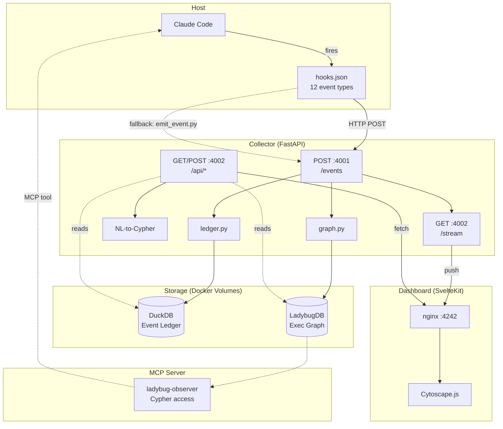
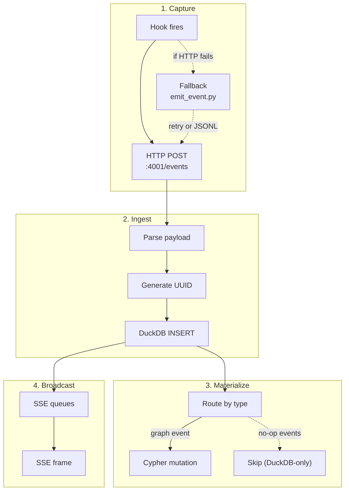
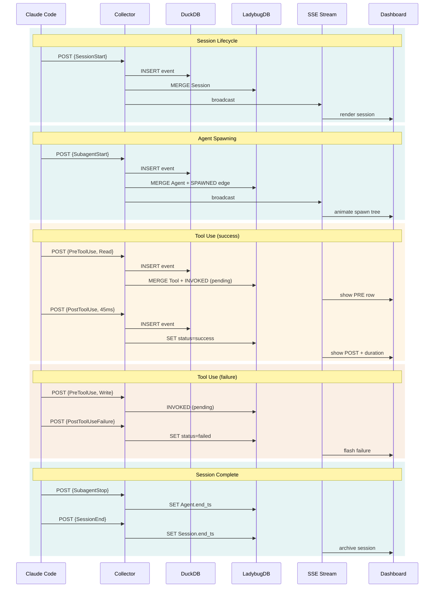
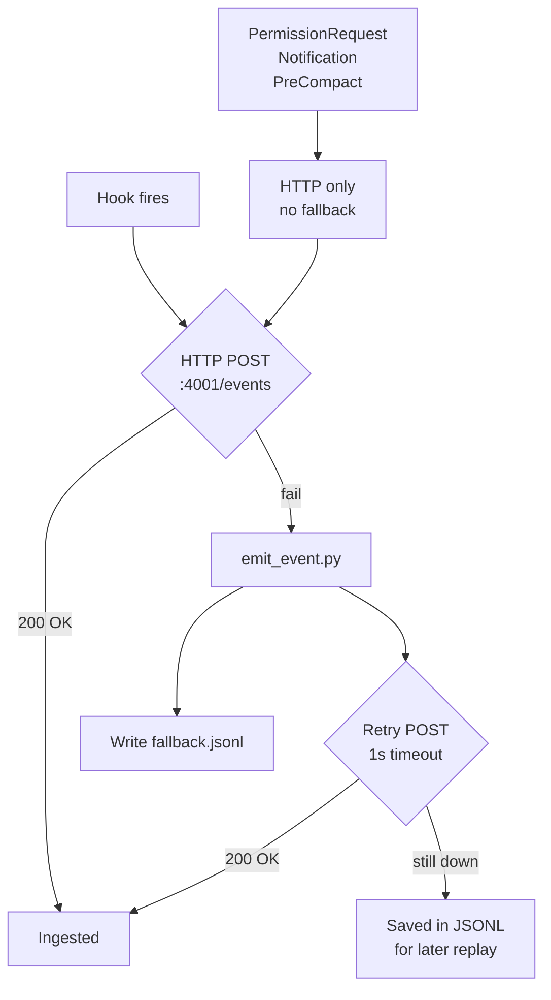
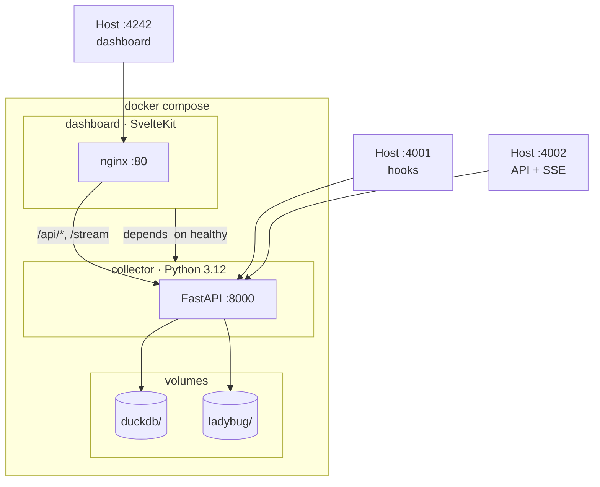

# Architecture

## System Overview

Local observability stack for Claude Code. Hooks capture lifecycle events, dual-database architecture stores them (DuckDB for analytics, LadybugDB for graph queries), real-time dashboard surfaces everything.

## Event Lifecycle

Deterministic pipeline: hook capture, HTTP delivery, DuckDB write (always), graph materialization (best-effort), SSE broadcast.

## Complete Event Journey

Single session from start to completion — each event flowing through the system.

## Storage Strategy

Two databases because they solve fundamentally different problems.

| Dimension | DuckDB | LadybugDB |
|---|---|---|
| **Data model** | Flat event rows | Labeled property graph |
| **Primary use** | Analytics, aggregation, full-text search | Topology, traversal, relationships |
| **Mutability** | Append-only (immutable ledger) | Live mutations per event |
| **Recovery** | Source of truth | Rebuilt from DuckDB via `replay.py` |
| **Query language** | SQL | Cypher |
| **Best for** | "What happened at 14:03?" | "Who spawned whom?" |
| **Size** | Grows with event count | Grows with session topology |

DuckDB is the immutable source of truth. LadybugDB is a materialized view. If LadybugDB gets corrupted, `scripts/replay.py` rebuilds it by replaying all events from DuckDB in order.

## Hook Delivery

Dual delivery: HTTP primary, command fallback for resilience.

Three events skip the command fallback — spawning a subprocess during permission dialogs would block Claude Code.

## Docker Compose Topology

Two services, shared volumes.

| Service | Image | Ports | Purpose |
|---|---|---|---|
| `collector` | `./collector` (Python 3.12) | `4001:8000`, `4002:8000` | Event ingestion, graph materialization, REST + SSE API |
| `dashboard` | `./dashboard` (SvelteKit + nginx) | `4242:80` | Static SvelteKit build served by nginx, proxies API to collector |

Ports 4001 and 4002 both map to internal port 8000. Single-process FastAPI app — the port split is for clarity (4001 = hooks, 4002 = dashboard API).

**Volumes:**

| Host Path | Container Path | Contents |
|---|---|---|
| `./data/duckdb/` | `/data/duckdb/` | `events.db` |
| `./data/ladybug/` | `/data/ladybug/` | LadybugDB data directory |

Data persists across container restarts and `docker compose down`. Only `docker compose down -v` removes volumes.

## Port Map

| Port | Service | Protocol | Purpose |
|---|---|---|---|
| `4242` | Dashboard | HTTP | SvelteKit UI |
| `4001` | Collector | HTTP | Hook ingestion (`POST /events`) |
| `4002` | Collector | HTTP + SSE | REST API (`/api/*`) + SSE (`/stream`) |

All localhost-only. No auth — single-user local tool.
