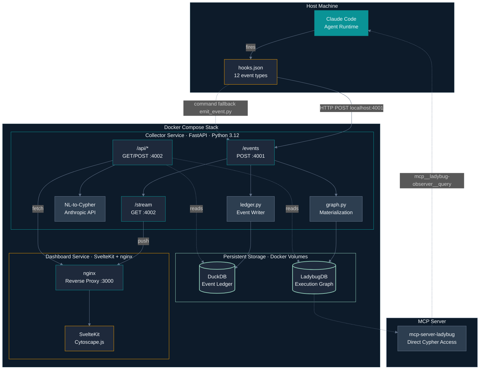
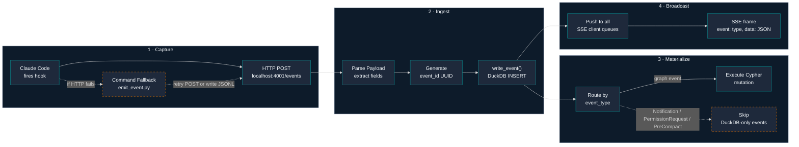
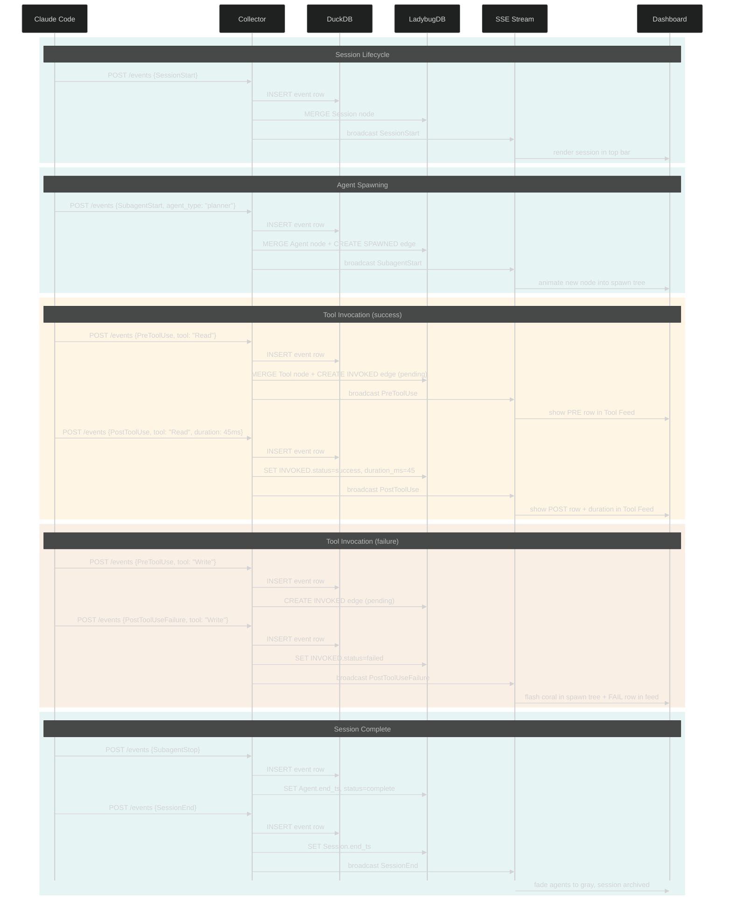
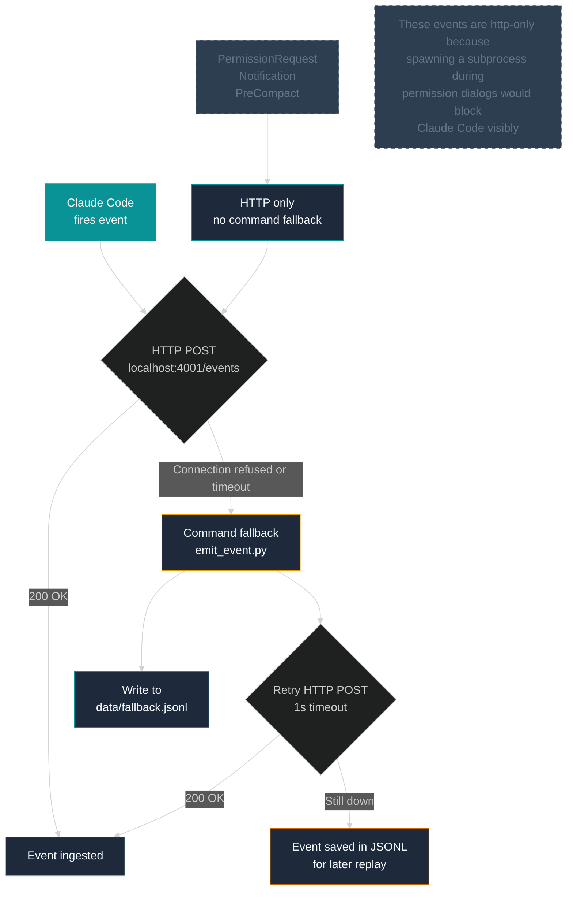

# Architecture

## System Overview

CC Observer is a local observability stack for Claude Code. It captures lifecycle events via hooks, stores them in a dual-database architecture (DuckDB for analytics, LadybugDB for graph queries), and serves a real-time dashboard.

## Event Lifecycle

Every event goes through a deterministic pipeline: hook capture, HTTP delivery, DuckDB write (always), graph materialization (best-effort), SSE broadcast.

## Complete Event Journey

This sequence diagram traces a single session from start to completion, showing how each event flows through the system.

## Storage Strategy

CC Observer uses two databases because they solve fundamentally different problems.

| Dimension | DuckDB | LadybugDB |
|---|---|---|
| **Data model** | Flat event rows | Labeled property graph |
| **Primary use** | Analytics, aggregation, full-text search | Topology, traversal, relationships |
| **Mutability** | Append-only (immutable ledger) | Live mutations per event |
| **Recovery** | Source of truth | Rebuilt from DuckDB via `replay.py` |
| **Query language** | SQL | Cypher |
| **Best for** | "What happened at 14:03?" "p95 latency?" | "Who spawned whom?" "Full spawn tree?" |
| **Size** | Grows with event count | Grows with session topology |

**Key design decision:** DuckDB is the immutable source of truth. LadybugDB is a materialized view of the graph structure. If LadybugDB gets corrupted, `scripts/replay.py` rebuilds it by replaying all events from DuckDB in order.

## Hook Delivery

Events reach the collector through dual delivery: HTTP primary with a command fallback for resilience.

## Docker Compose Topology

The stack runs two services with shared volumes for persistent storage.

| Service | Image | Ports | Purpose |
|---|---|---|---|
| `collector` | `./collector` (Python 3.12) | `4001:8000`, `4002:8000` | Event ingestion, graph materialization, REST + SSE API |
| `dashboard` | `./dashboard` (SvelteKit + nginx) | `3000:80` | Static SvelteKit build served by nginx, proxies API to collector |

Both ports 4001 and 4002 map to the same internal port 8000 in the collector container. This is a single-process FastAPI app — the port split is for clarity (4001 = hooks, 4002 = dashboard API).

**Volume mounts:**

| Host Path | Container Path | Contents |
|---|---|---|
| `./data/duckdb/` | `/data/duckdb/` | `events.db` — DuckDB file |
| `./data/ladybug/` | `/data/ladybug/` | LadybugDB data directory |

Data persists across container restarts and survives `docker compose down`. Only `docker compose down -v` removes volumes.

## Port Map

| Port | Service | Protocol | Purpose |
|---|---|---|---|
| `3000` | Dashboard | HTTP | SvelteKit UI |
| `4001` | Collector | HTTP | Hook event ingestion (`POST /events`) |
| `4002` | Collector | HTTP + SSE | REST API (`/api/*`) and SSE stream (`/stream`) |

All ports are localhost-only. No auth required — this is a single-user local tool.
