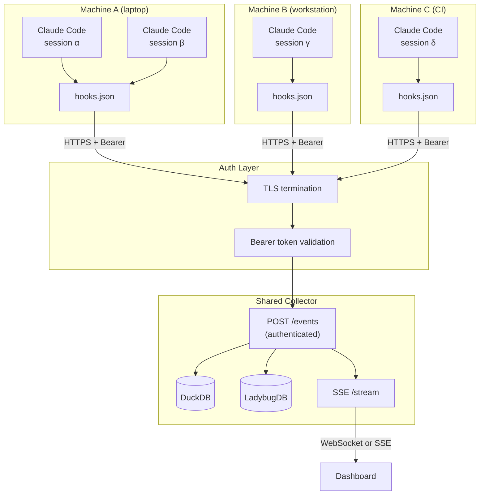

# Session Discovery & Hook Registration

How CC Observer discovers Claude Code sessions, registers hooks, and captures events. Current behavior, multi-session mechanics, and future remote topology.

---

## How It Works Today

### Plugin Installation

The full sequence from zero to first captured event:

1. **Clone the repo** and start the Docker stack:
   ```bash
   git clone https://github.com/halcyondude/observable-claude.git
   cd observable-claude
   docker compose up -d
   ```
   This starts the collector (FastAPI on port 4001/4002) and dashboard (SvelteKit/nginx on port 4242). The collector is now listening at `POST localhost:4001/events`.

2. **Install the plugin** into Claude Code:
   ```bash
   claude plugin add --path ./observable-claude
   ```
   Claude Code reads `.claude-plugin/plugin.json` from the plugin root. The manifest declares:
   ```json
   {
     "hooks": "hooks/hooks.json",
     "commands": ["commands/*.md"],
     "skills": ["skills/*/SKILL.md"],
     "agents": ["agents/*.md"]
   }
   ```
   The `hooks` field is the key — Claude Code resolves the path relative to the plugin root and loads `hooks/hooks.json`.

3. **Hook registration is automatic.** Once the plugin is installed, Claude Code merges the plugin's hooks into its hook dispatch table. Every session launched after plugin installation fires the 12 registered event types. No per-session configuration, no per-workspace opt-in. The plugin is global to the Claude Code installation.

4. **First event fires** when the next Claude Code session starts. The `SessionStart` hook POSTs the session payload to `http://localhost:4001/events`. The collector writes it to DuckDB, materializes a Session node in LadybugDB, and broadcasts via SSE.

### Hook Dispatch Mechanics

Each of the 12 event types in `hooks.json` declares one or two delivery mechanisms:

| Delivery | Mechanism | When Used |
|---|---|---|
| **HTTP (primary)** | `POST http://localhost:4001/events` | All 12 event types |
| **Command (fallback)** | `python ${CLAUDE_PLUGIN_ROOT}/scripts/emit_event.py <EventType>` | 9 of 12 events |

Three events — `PermissionRequest`, `Notification`, `PreCompact` — are HTTP-only. Spawning a subprocess during permission dialogs would visibly block Claude Code.

The `${CLAUDE_PLUGIN_ROOT}` variable is resolved by Claude Code at dispatch time to the absolute path of the plugin directory. This is how `emit_event.py` finds its way back to the plugin's `data/` directory for fallback JSONL writes.

### Fallback Behavior

When the collector is down, `emit_event.py` provides resilience:

1. Reads the hook payload from stdin
2. Appends to `data/fallback.jsonl` (always, regardless of HTTP status)
3. Attempts HTTP POST with a 1-second timeout
4. Exits 0 unconditionally — never blocks Claude Code

The fallback JSONL file is a local safety net. Events accumulate there and can be replayed once the collector comes back up.

### What the Payload Contains

Claude Code injects standard fields into every hook payload:

- `session_id` — unique per session, stable for the session's lifetime
- `event_type` — the hook event name
- `cwd` — working directory at session start
- `agent_id` — identifies the agent within the session
- `tool_use_id` — correlation key for Pre/PostToolUse pairs
- Full tool input/output for tool events, prompt text for user submissions

The collector doesn't need to do any discovery — each event self-identifies via `session_id`.

---

## Multi-Session Local Behavior

This is the scenario I care about most: 5-10 concurrent Claude Code sessions across multiple repos and terminal windows.

### How It Works

Every Claude Code instance independently fires hooks to the same collector endpoint (`localhost:4001`). There is no coordination between sessions. The architecture is shared-nothing from the session side.

```
Terminal 1 (observable-claude)  ──POST──┐
Terminal 2 (observable-claude)  ──POST──┤
Terminal 3 (wolfpack)           ──POST──├──▶ localhost:4001/events ──▶ DuckDB + LadybugDB
Terminal 4 (dt-core)            ──POST──┤
Terminal 5 (dt-core)            ──POST──┘
```

**Session isolation is by `session_id`.** Each session gets a unique ID from Claude Code. The collector routes events to the correct DuckDB rows and LadybugDB subgraph based on this ID. Two sessions in the same repo are separate graph topologies — they share a Workspace node but have distinct Session nodes.

**Concurrency at the collector** is handled by FastAPI's async request handling. Hook POSTs are fast (single-digit ms for DuckDB write + Cypher mutation). There's no queue, no batching — events are processed inline. For the expected load (dozens of events per minute across all sessions), this is more than adequate.

**SSE broadcasts all sessions.** The `/stream` endpoint pushes every event from every session to every connected client. The dashboard client filters by session. The Galaxy View (multi-session overview, see `multi-session-overview.md`) consumes the full stream and routes events to the appropriate workspace lane.

### What Could Go Wrong

- **Port collision**: impossible in the current design. All sessions POST to the same collector. The collector is the singleton, not the sessions.
- **DuckDB write contention**: DuckDB handles concurrent writes from a single process. The collector is single-process — all writes go through one FastAPI instance. No contention.
- **Session ID collision**: Claude Code generates unique session IDs. Not our problem to solve.

---

## Future: Remote / Shared Collector

Not planned for current scope. Documenting the architecture sketch so we don't paint ourselves into a corner.

### The Scenario

Multiple machines — my laptop, a CI runner, a colleague's workstation — all sending events to a shared collector. Central visibility into all Claude Code activity.

### What Changes



### Hard Problems

**Authentication.** The current system has zero auth — `localhost:4001`, no tokens, no TLS. A remote collector needs:
- TLS termination (minimum: Let's Encrypt, or Tailscale for zero-config)
- Bearer token per machine for hook delivery
- Dashboard auth for SSE and REST access
- hooks.json would need the collector URL and auth token injected — either via env vars in the hook URL or a local proxy

**Network topology.** Hooks fire HTTP POSTs. If the collector is behind NAT or a firewall, the hook can't reach it. Options:
- Tailscale / WireGuard mesh (simplest — every machine sees the collector as a local address)
- Cloud-hosted collector with public endpoint (HTTPS + auth)
- Local agent that buffers and forwards (adds complexity)

**Clock skew.** Events from different machines have different wall clocks. The collector currently uses `received_at` (server timestamp) as the ordering key, which helps — but `start_ts` / `end_ts` on tool spans come from the client. Cross-machine span durations are fine (relative), but cross-machine event ordering can be wrong by seconds. Solutions: NTP discipline, or the collector re-stamps everything and treats client timestamps as advisory.

**Event ordering.** Even with synchronized clocks, network latency means events can arrive out of order across machines. Within a single session this is less of a problem (one machine, sequential hook dispatch). Across sessions on different machines, the collector should not assume arrival order equals chronological order. DuckDB's `received_at` ordering is "good enough" for analytics; LadybugDB graph mutations are idempotent (MERGE), so out-of-order arrival doesn't corrupt the graph.

**Privacy.** Hook payloads contain tool inputs, file paths, prompt text — potentially sensitive content. Shipping that over a network raises questions:
- Who can see which sessions? Per-user isolation? Per-team?
- Data retention and deletion policies
- Payload filtering — strip tool_input/tool_response before transmission?
- Compliance (GDPR, SOC2) if this becomes a team tool

**Fallback changes.** `emit_event.py` writes to local `data/fallback.jsonl`. In a remote scenario, the fallback file is on the sending machine, not the collector. You'd need a forward-and-drain mechanism: buffer locally, ship when the collector is reachable. This is basically an agent/sidecar pattern.

### What Stays the Same

- `session_id` as the correlation key — works across machines
- DuckDB as append-only ledger — one table, one schema, multi-machine events just have more rows
- LadybugDB graph structure — Session/Agent/Tool nodes don't care which machine they came from
- SSE broadcast model — dashboard subscribes to the stream, filters by session/workspace
- The `replay.py` recovery path — still works, still rebuilds from DuckDB

---

## Design Constraints

Things the current architecture must not do if we want remote support to remain viable:

1. **Don't hardcode `localhost` in the collector.** The hooks.json hardcodes `localhost:4001`. That's fine — it's the hook config, not the collector config. Each machine's plugin would have its own hooks.json pointing to the appropriate collector URL. But the collector itself should not assume local-only clients. No `127.0.0.1` bind restrictions in the Docker config — bind to `0.0.0.0` (which it already does via Docker port mapping).

2. **Don't embed machine identity in the session_id.** Claude Code generates session IDs. If we ever add a `machine_id` or `source_host` field, it should be a separate column, not munged into existing keys. The graph schema should not need to change.

3. **Don't rely on filesystem paths for cross-machine correlation.** `cwd` paths are machine-local (`/Users/matt/gh/...` vs `/home/ci/...`). Workspace grouping in Galaxy View uses raw paths today. For remote support, we'd need a workspace identity that's path-independent — probably the git remote URL. But don't add that complexity now. Just don't build features that assume paths are globally unique identifiers.

4. **Don't drop the command fallback.** `emit_event.py` and `fallback.jsonl` are the resilience layer. A remote collector will have more failure modes (network partitions, auth expiry, DNS issues). The local fallback becomes the buffer-and-forward queue. Keep it.

5. **Don't assume single-writer DuckDB.** Today one collector process writes to one DuckDB file. Remote support might mean multiple collector instances, or a collector that accepts writes from multiple authenticated sources. DuckDB is single-writer by design — if we ever need multi-writer, we'd need a different ledger (Postgres, ClickHouse). For now, keep the single-collector architecture, but don't build features that assume the collector will always be colocated with the DuckDB file.

6. **Keep event payloads self-describing.** Every event should carry enough context to be processed independently: `session_id`, `event_type`, `agent_id`, timestamps. No implicit state that requires the collector to have seen previous events from that session. The current design already does this — maintain it.
