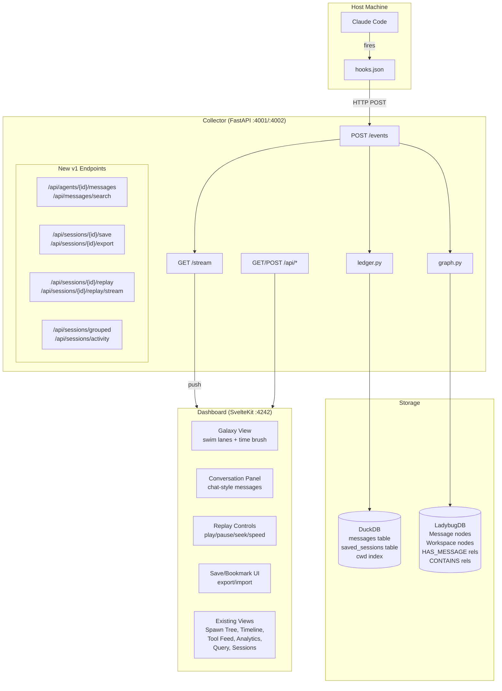
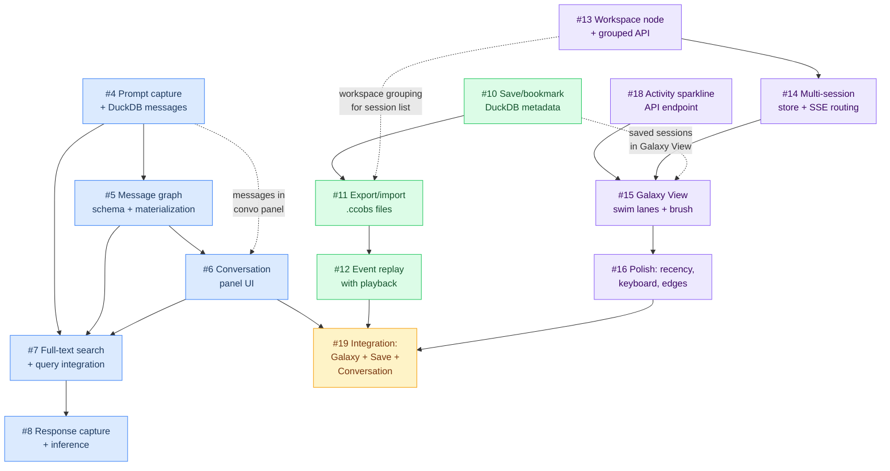

# CC Observer v1 — Execution Plan

> Three epics, thirteen issues, three parallel tracks, one dashboard. This is the plan to ship v1.

---

## System Architecture — v1 Target State

Everything in the current system stays. Three feature sets layer on top: agent conversations (content capture), session persistence (save/replay), and multi-session overview (Galaxy View). They share the same collector, the same DuckDB ledger, the same LadybugDB graph, and the same SSE pipe.



### What's new in v1

| Component | Addition | Epic |
|---|---|---|
| **DuckDB** | `messages` table, `saved_sessions` table, `cwd` index | #3, #9, #17 |
| **LadybugDB** | `Message` + `Workspace` node tables, `HAS_MESSAGE` + `NEXT` + `CONTAINS` rels | #3, #17 |
| **Collector API** | 11 new endpoints across messages, save/export/import, replay, grouped sessions | #3, #9, #17 |
| **SSE** | New `message` event type, replay SSE channel, multi-session routing | #3, #9, #17 |
| **Dashboard** | Galaxy View (new), Conversation Panel (new), Replay Controls (new), Save/Bookmark UI (new), multi-session store refactor | #3, #9, #17 |

---

## Dependency Graph

Every sub-issue as a node. Edges show "must complete before." Color-coded by epic.



### Critical Path

The longest sequential chain determines the earliest possible ship date.

**Galaxy View track** is the critical path:

```
#13 (M) → #14 (M) → #15 (L) → #16 (M) → Integration
```

This is 4 issues, roughly 1.5-2 weeks of sequential work for one engineer. The other two tracks finish sooner and wait at the integration point.

---

## Parallel Execution Plan

Three independent tracks that can execute simultaneously. Each track has a single engineer who owns it end-to-end. Tracks converge at integration.

### Track Layout

| Week | Track A: Conversations | Track B: Save/Replay | Track C: Galaxy View |
|---|---|---|---|
| **1** | #4 Prompt capture (M) | #10 Save/bookmark (S) | #13 Workspace node + API (M) |
| **1** | | #11 Export/import (M) | #18 Activity sparkline API (S) |
| **2** | #5 Message graph schema (M) | #12 Event replay (L, starts) | #14 Multi-session store (M) |
| **2** | #6 Conversation panel (L, starts) | #12 Event replay (L, cont.) | #15 Galaxy View UI (L, starts) |
| **3** | #6 Conversation panel (L, cont.) | #12 Event replay (L, done) | #15 Galaxy View UI (L, cont.) |
| **3** | #7 Search + query (M) | | #16 Polish + edge cases (M) |
| **4** | #8 Response inference (L) | **Integration** | **Integration** |
| **4** | **Integration** | | |

### Immediate Starts (zero dependencies)

These three issues have no blockers and can begin right now, in parallel:

| Issue | Track | Size | Why it's unblocked |
|---|---|---|---|
| **#4** Prompt capture + DuckDB messages | A | M | Extends existing collector. No schema conflicts. |
| **#10** Save/bookmark | B | S | New DuckDB table + simple API. Self-contained. |
| **#13** Workspace node + grouped API | C | M | New graph node + new API endpoints. Additive. |

**#18** (Activity sparkline API) is also unblocked — it's a standalone DuckDB query endpoint. Can start alongside #13 in Track C.

### Parallel Tracks

**Track A — Agent Conversations** (Epic #3)
Owner: engineer with collector + graph + dashboard range.

```
#4 → #5 → #6 → #7 → #8
```

Sequential chain. #4 creates the messages table that everything else reads. #5 adds graph nodes. #6 builds the UI. #7 adds search. #8 adds response inference (blocked on Claude Code hook evolution — can ship as "inferred" mode initially).

**Track B — Session Persistence** (Epic #9)
Owner: engineer comfortable with file I/O, SSE, and playback timing.

```
#10 → #11 → #12
```

Tight sequential chain. #10 is small (few hours). #11 is medium. #12 is the big one — replay SSE channel with playback controls.

**Track C — Galaxy View** (Epic #17)
Owner: engineer strong on SvelteKit, uPlot, and real-time dashboard state.

```
#13 + #18 (parallel) → #14 → #15 → #16
```

#13 and #18 are both backend API work and can run in parallel or be done by the same person sequentially. #14 is the critical dashboard plumbing (store refactor). #15 is the big UI build. #16 is polish.

### Merge Points

Three moments where tracks must sync:

**Merge 1: Galaxy View + Save indicators** (after #10 and #15)
Galaxy View session bars need bookmark indicators from #10's saved_sessions data. Light touch — a star icon on bars for saved sessions. Can be handled during #16 polish.

**Merge 2: Export + Workspace grouping** (after #11 and #13)
The `.ccobs` export format should include workspace metadata from #13's Workspace node. Minor addition to the export assembler.

**Merge 3: Full integration** (after #8, #12, #16)
All three epics complete. Integration work:
- Conversation panel accessible from Galaxy View session detail
- Replay works with conversation data (messages replay alongside events)
- Saved session detail in Galaxy View shows message counts
- End-to-end smoke test: live session → save → export → import → replay → Galaxy View shows it all

---

## Integration Points — Cross-Epic Touchpoints

Where features from different epics interact. Each needs explicit attention during integration.

| Touchpoint | Source | Target | Nature of Integration |
|---|---|---|---|
| Saved session indicators in Galaxy View | #10 (save/bookmark) | #15 (Galaxy View) | Session bars show star icon for saved sessions. Query `saved_sessions` table during `GET /api/sessions/grouped`. |
| Conversation data in Galaxy View detail | #4 (prompt capture) | #15 (Galaxy View) | Session detail panel shows message count. "Open Conversation" button navigates to Spawn Tree with conversation tab open. |
| Workspace metadata in export | #13 (workspace node) | #11 (export) | `.ccobs` file includes workspace path/name. Minor field addition. |
| Message replay during playback | #4 (messages table) | #12 (replay) | Replay SSE channel emits `message` events alongside structural events. Conversation panel updates during replay. |
| Multi-session SSE + conversation events | #14 (SSE routing) | #6 (conversation panel) | SSE `message` events routed to correct session's store. Conversation panel subscribes to per-session message stream. |
| NL query schema update | #5 (Message nodes) | #13 (Workspace nodes) | NL-to-Cypher system prompt needs both Message and Workspace schema additions. Single update to `nl_query.py`. |

---

## Wireframe Descriptions

### Galaxy View with Swim Lanes and Time Brush

The primary new surface. Entry point when 2+ sessions exist.

**Top zone (64px):** uPlot sparkline showing event density over time, stacked by workspace color. Drag handle creates a time window selection. The selected range controls what appears in the swim lanes below.

**Middle zone (flexible):** Workspace swim lanes. Each workspace (unique `cwd`) gets a horizontal lane. Lane header shows workspace name, active/total session counts. Sessions render as horizontal bars proportional to duration on the shared time axis. Active sessions have teal color with animated right edge (still growing). Completed sessions are muted gray. Failed sessions have coral left border. Bar height scales with agent count (24-40px). Bars show session ID, branch name, and agent count badge when wide enough.

**Right zone (320px, on-demand):** Detail panel slides in when clicking a session bar. Shows session ID, status, workspace, branch, timing, agent/event counts, and a mini spawn tree preview (tiny Cytoscape canvas). Action buttons navigate to full Spawn Tree or Timeline for that session. Saved sessions show bookmark name, notes, tags (from #10 integration).

### Conversation Panel

Appears as a tab within the Spawn Tree's node detail panel (320px right panel). Activated by clicking an agent node and selecting the "Conversation" tab.

**Layout:** Chat-style message bubbles. User/system messages left-aligned on dark surface. Assistant messages right-aligned with teal tint. Tool calls rendered as collapsed cards between messages. Each message shows role badge, timestamp, and content. Long messages (>500 chars) show preview with expand toggle.

**Controls:** Copy per-message and copy-all. Cmd+F search within panel. Permalink hash per message for sharing.

**Data source:** `GET /api/agents/{id}/messages` — all messages for the selected agent, ordered by sequence.

### Session Bookmark / Replay Controls

**Bookmark UI:** Star icon on every session row in Session History and every session bar in Galaxy View. Click to save — inline form for name, notes, tags. Saved sessions get a dedicated "Saved Sessions" section at the top of Session History, sorted by save date. Export button (download `.ccobs`) on saved sessions. Import button in Session History header.

**Replay Controls:** Toolbar appears at the bottom of the viewport when viewing a saved or historical session. Play/pause button, speed selector (1x/2x/5x/10x/max), timeline scrubber, event counter ("Event 23 of 147"), current timestamp display. All dashboard views animate during replay — Spawn Tree grows, Timeline bars extend, Tool Feed populates. Same rendering path as live sessions, different event source (replay SSE channel vs live SSE).

### How They Fit Together in the Dashboard Shell

The dashboard shell (top bar + left sidebar + content area) stays unchanged. New additions:

1. **Galaxy View** becomes the 7th view in the sidebar (position 0, before Spawn Tree). Default when 2+ sessions exist.
2. **Conversation Panel** lives inside Spawn Tree's existing detail panel as a new tab. No new top-level view.
3. **Replay Controls** are a floating toolbar at the bottom of the content area, visible in any view during replay mode. Not a sidebar item.
4. **Save/Bookmark UI** enhances Session History (star icons, saved section, export/import buttons). Also appears as star icons on Galaxy View session bars.
5. **Navigation flow:** Galaxy View → click session → detail panel → "Open Spawn Tree" → click agent → "Conversation" tab → see prompts. Or: Session History → find saved session → click replay → watch it unfold across all views.

---

## Issue Inventory

### Epic #3 — Agent Conversations

| Issue | Title | Size | Difficulty | Labels | Blocked By |
|---|---|---|---|---|---|
| #4 | Prompt capture + DuckDB messages | M | Involved (3/10) | collector, storage | None |
| #5 | Message graph schema + materialization | M | Involved (4/10) | collector, graph-schema | #4 |
| #6 | Conversation panel UI | L | Hard (5/10) | dashboard | #4, #5 |
| #7 | Full-text search + query integration | M | Involved (3/10) | dashboard, api | #4, #5, #6 |
| #8 | Response capture + inference | L | Hard (6/10) | collector, hooks | #7 |

### Epic #9 — Session Save & Replay

| Issue | Title | Size | Difficulty | Labels | Blocked By |
|---|---|---|---|---|---|
| #10 | Save/bookmark + DuckDB metadata | S | Routine (2/10) | collector, dashboard, storage | None |
| #11 | Export/import .ccobs files | M | Involved (4/10) | collector, dashboard, api | #10 |
| #12 | Event replay with playback controls | L | Hard (6/10) | collector, dashboard, api | #11 |

### Epic #17 — Multi-Session Galaxy View

| Issue | Title | Size | Difficulty | Labels | Blocked By |
|---|---|---|---|---|---|
| #13 | Workspace node + grouped session API | M | Involved (3/10) | collector, graph-schema, storage, api | None |
| #18 | Activity sparkline API endpoint | S | Routine (2/10) | collector, api | None |
| #14 | Multi-session dashboard store + SSE routing | M | Involved (4/10) | dashboard | #13 |
| #15 | Galaxy View swim lanes + time brush | L | Hard (6/10) | dashboard | #14, #18 |
| #16 | Polish: recency, keyboard, edge cases | M | Involved (4/10) | collector, dashboard | #15 |

### Integration Issue

**#19: v1 integration and end-to-end validation**

Cross-epic integration work that doesn't belong in any single track:
- Saved session indicators in Galaxy View bars
- Conversation data in Galaxy View session detail
- Workspace metadata in `.ccobs` export format
- Message events in replay SSE channel
- NL-to-Cypher schema update for Message + Workspace nodes
- End-to-end smoke test across all three features

**Type:** feature
**Size:** M
**Difficulty:** Involved (4/10)
**Blocked by:** #8, #12, #16 (all three epics substantially complete)

---

## Parallelization Summary

**Immediate starts (day 1):** #4, #10, #13, #18

**Three parallel tracks:**
- Track A (Conversations): #4 → #5 → #6 → #7 → #8
- Track B (Save/Replay): #10 → #11 → #12
- Track C (Galaxy View): #13 + #18 → #14 → #15 → #16

**Critical path:** Track C — Galaxy View. Longest sequential chain at ~2 weeks.

**Merge point:** After all three tracks complete, one integration issue ties them together.

**With 3 engineers:** ~3.5 weeks to v1. Track C sets the pace.
**With 2 engineers:** ~4.5 weeks. Run Track A + Track C in parallel, then Track B.
**With 1 engineer:** ~6-7 weeks. Execute tracks sequentially, prioritize Track C (most user-visible value) then Track B (persistence), then Track A (content depth).

---

## Risk Register

| Risk | Impact | Likelihood | Mitigation |
|---|---|---|---|
| Claude Code hooks don't add response/output field | #8 ships as inference-only, no full response capture | Medium | Already designed for this — inference mode is the plan, full capture is the upgrade path |
| uPlot integration complexity for time brush | #15 takes longer than estimated | Low | uPlot is well-documented. Sparkline + brush is a standard use case. |
| Multi-session SSE routing breaks existing single-session views | Regression in live monitoring | Medium | #14 must maintain backward compat. `activeSessionId` stays as "drilled-into session." Heavy testing. |
| `.ccobs` format needs revisions after v1 | Breaking changes for exported files | Medium | Version field in format (`"version": 1`). Forward-compatible by design. |
| LadybugDB memory footprint with Message + Workspace nodes | Performance degradation at scale | Low | Message nodes carry `content_preview` only (500 chars). Full content stays in DuckDB. Monitor during #5. |
