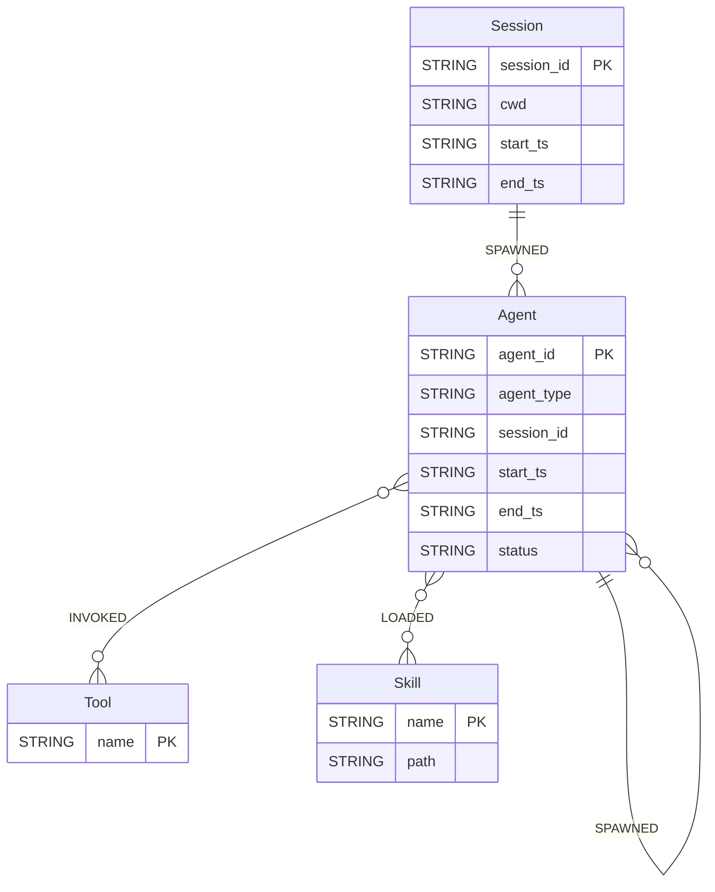
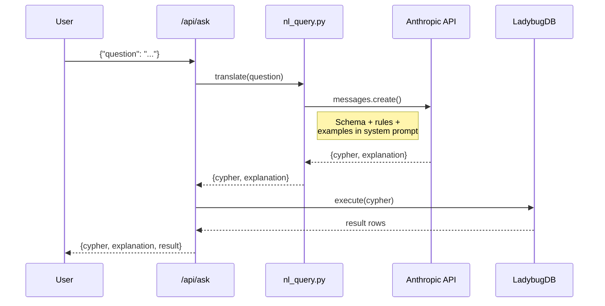
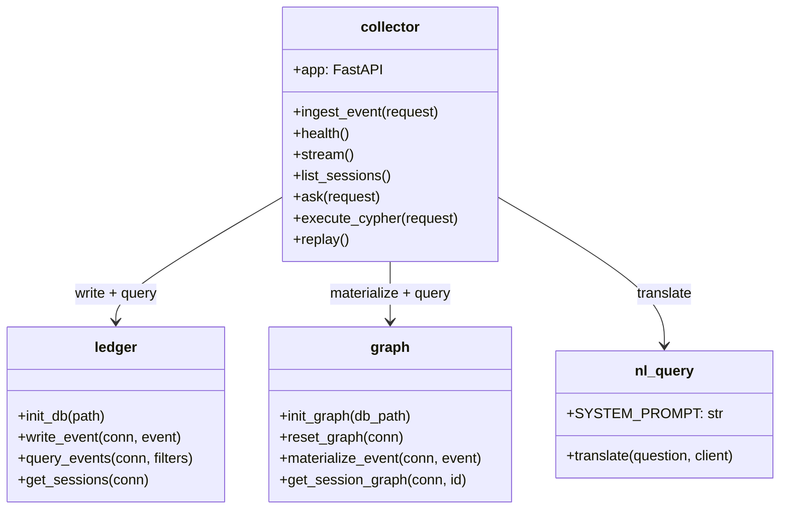

# Technical Specification

## Graph Schema (LadybugDB)

Four node types, three relationship types. Captures the full topology of a Claude Code session.



### Node DDL

```sql
CREATE NODE TABLE Session (
    session_id STRING, cwd STRING,
    start_ts STRING, end_ts STRING,
    PRIMARY KEY (session_id)
);

CREATE NODE TABLE Agent (
    agent_id STRING, agent_type STRING, session_id STRING,
    start_ts STRING, end_ts STRING, status STRING,
    PRIMARY KEY (agent_id)
);

CREATE NODE TABLE Skill (name STRING, path STRING, PRIMARY KEY (name));
CREATE NODE TABLE Tool  (name STRING, PRIMARY KEY (name));
```

### Relationship DDL

```sql
CREATE REL TABLE SPAWNED (
    FROM Session TO Agent, FROM Agent TO Agent,
    prompt STRING, depth INT64, spawned_at STRING
);

CREATE REL TABLE LOADED (
    FROM Agent TO Skill,
    loaded_at STRING
);

CREATE REL TABLE INVOKED (
    FROM Agent TO Tool,
    tool_use_id STRING, tool_input STRING,
    start_ts STRING, end_ts STRING,
    duration_ms INT64, status STRING, tool_response STRING
);
```

### Relationship Properties

| Relationship | Property | Type | Description |
|---|---|---|---|
| `SPAWNED` | `prompt` | STRING | Prompt that triggered the spawn |
| `SPAWNED` | `depth` | INT64 | Depth in spawn tree (0 = session root) |
| `SPAWNED` | `spawned_at` | STRING | ISO 8601 timestamp |
| `LOADED` | `loaded_at` | STRING | ISO 8601 timestamp |
| `INVOKED` | `tool_use_id` | STRING | Correlation key linking Pre/PostToolUse |
| `INVOKED` | `tool_input` | STRING | JSON-serialized tool input |
| `INVOKED` | `start_ts` | STRING | When PreToolUse fired |
| `INVOKED` | `end_ts` | STRING | When PostToolUse/Failure fired |
| `INVOKED` | `duration_ms` | INT64 | End-to-end tool call duration |
| `INVOKED` | `status` | STRING | `pending` / `success` / `failed` |
| `INVOKED` | `tool_response` | STRING | Truncated response (max 2000 chars) |

### Design Decisions

**Skill as node, not edge property:** Cross-session queries like "which agents loaded observer-context?" need traversal to a shared entity. Edge properties can't be traversed to. Nodes win for anything queried across sessions.

**Prompt as edge property, not node:** Prompts are metadata on spawn transitions, not entities you traverse to independently. DuckDB handles full-text search on prompts via the raw payload JSON column.

## DuckDB Schema

Every hook event stored as a flat row. Immutable source of truth — `scripts/replay.py` rebuilds the graph from here.

```sql
CREATE TABLE events (
    event_id    VARCHAR PRIMARY KEY,
    received_at TIMESTAMPTZ NOT NULL DEFAULT now(),
    event_type  VARCHAR NOT NULL,
    session_id  VARCHAR,
    agent_id    VARCHAR,
    agent_type  VARCHAR,
    tool_use_id VARCHAR,
    tool_name   VARCHAR,
    cwd         VARCHAR,
    payload     JSON
);

-- Indexes for common query patterns
CREATE INDEX idx_session   ON events(session_id);
CREATE INDEX idx_tool_pair ON events(tool_use_id);  -- correlate Pre/PostToolUse
CREATE INDEX idx_type      ON events(event_type);
CREATE INDEX idx_time      ON events(received_at);
```

### Field Extraction

The collector extracts structured fields from the hook payload before writing. Claude Code payloads use a nested structure:

```json
{
  "event": {
    "event_type": "PreToolUse",
    "tool_name": "Bash",
    "tool_use_id": "toolu_abc123",
    "tool_input": {"command": "ls -la"}
  },
  "session": {
    "session_id": "sess_xyz",
    "agent_id": "agent_001",
    "agent_type": "implementer",
    "cwd": "/home/user/project"
  }
}
```

`ledger.py` extracts from nested structure with a flat fallback for forward compatibility.

## Collector API Reference

Single FastAPI app on internal port 8000. Docker maps to 4001 (ingestion) and 4002 (API).

### Event Ingestion

#### `POST /events`

Hook ingestion. Writes to DuckDB, materializes in LadybugDB, broadcasts via SSE.

**Request:**
```json
{
  "event": {"event_type": "SessionStart", "timestamp": "2025-01-15T10:30:00Z"},
  "session": {"session_id": "sess_abc", "cwd": "/home/user/project"}
}
```

**Response:**
```json
{"event_id": "550e8400-e29b-41d4-a716-446655440000", "status": "ok"}
```

Graph materialization is best-effort — failures are logged but never block ingestion.

### Health

#### `GET /health`

```json
{"status": "ok", "events_total": 1247, "uptime_seconds": 3600.5}
```

### SSE Stream

#### `GET /stream`

Server-Sent Events. Each ingested event pushed to all connected clients.

**Frame format:**
```
event: PreToolUse
data: {"event_id": "...", "event": {"event_type": "PreToolUse", ...}, "session": {...}}
```

`event:` field is the `event_type` for client-side filtering. `asyncio.Queue` per client, 256-event buffer. Slow clients get dropped.

### Session Endpoints

#### `GET /api/sessions`

All sessions, ordered by first event time descending.

```json
[
  {"session_id": "sess_abc", "first_event": "2025-01-15T10:30:00Z", "last_event": "2025-01-15T11:45:00Z", "cwd": "/home/user/project"}
]
```

#### `GET /api/sessions/active`

Sessions with `SessionStart` but no `SessionEnd`.

#### `GET /api/sessions/{id}/graph`

Cytoscape.js-compatible JSON for the session's execution graph.

```json
{
  "nodes": [
    {"data": {"id": "sess_abc", "label": "Session", "type": "Session", "cwd": "/home/user/project"}},
    {"data": {"id": "agent_001", "label": "planner", "type": "Agent", "status": "running"}}
  ],
  "edges": [
    {"data": {"source": "sess_abc", "target": "agent_001", "label": "SPAWNED", "prompt": "Plan the implementation"}}
  ]
}
```

#### `GET /api/sessions/{id}/timeline`

Gantt-compatible timeline data with nested tool events.

```json
[
  {
    "agent_id": "agent_001",
    "agent_type": "planner",
    "start_ts": "2025-01-15T10:30:05Z",
    "end_ts": "2025-01-15T10:32:15Z",
    "status": "complete",
    "depth": 0,
    "tool_events": [
      {"tool_use_id": "toolu_1", "tool_name": "Read", "start_ts": "...", "end_ts": "...", "status": "success"}
    ]
  }
]
```

### Event Query

#### `GET /api/events`

Paginated raw events from DuckDB.

| Parameter | Type | Default | Description |
|---|---|---|---|
| `event_type` | string | — | Filter by event type |
| `session_id` | string | — | Filter by session |
| `agent_id` | string | — | Filter by agent |
| `tool_use_id` | string | — | Filter by tool call |
| `limit` | int | 100 | Results per page (1-1000) |
| `offset` | int | 0 | Pagination offset |

### NL and Cypher Query

#### `POST /api/ask`

Natural language to Cypher, execute, return results.

**Request:**
```json
{"question": "which agents are currently running?"}
```

**Response (success):**
```json
{
  "cypher": "MATCH (a:Agent {status: 'running'}) RETURN a.agent_id, a.agent_type, a.start_ts ORDER BY a.start_ts",
  "explanation": "Finds all agents with status 'running', ordered by start time",
  "result": [
    {"a.agent_id": "agent_001", "a.agent_type": "planner", "a.start_ts": "2025-01-15T10:30:05Z"}
  ]
}
```

**Response (error):**
```json
{"error": "Query failed", "details": "..."}
```

#### `POST /api/cypher`

Raw Cypher execution against LadybugDB.

**Request:**
```json
{"cypher": "MATCH (s:Session) RETURN s.session_id, s.cwd"}
```

**Response:**
```json
{
  "result": [{"s.session_id": "sess_abc", "s.cwd": "/home/user/project"}]
}
```

### Graph Management

#### `POST /api/replay`

Rebuild LadybugDB from DuckDB. Drops all graph tables, recreates, replays every event chronologically.

```json
{"status": "ok", "events_replayed": 1247, "errors": 0}
```

## Hook Event Reference

12 lifecycle event types. Each handled differently.

| Event | Group | Graph Mutation | DuckDB | SSE |
|---|---|---|---|---|
| `SessionStart` | Session | CREATE/MERGE Session | Yes | Yes |
| `SessionEnd` | Session | SET Session.end_ts | Yes | Yes |
| `SubagentStart` | Agent | CREATE Agent + SPAWNED | Yes | Yes |
| `SubagentStop` | Agent | SET Agent.end_ts, status | Yes | Yes |
| `Stop` | Agent | SET Agent.status=complete | Yes | Yes |
| `UserPromptSubmit` | Conversation | No-op (DuckDB only) | Yes | Yes |
| `PreToolUse` | Tool | MERGE Tool + INVOKED (pending) | Yes | Yes |
| `PostToolUse` | Tool | SET INVOKED success + duration | Yes | Yes |
| `PostToolUseFailure` | Tool | SET INVOKED failed | Yes | Yes |
| `Notification` | Conversation | No-op | Yes | Yes |
| `PermissionRequest` | Tool | No-op | Yes | Yes |
| `PreCompact` | Maintenance | No-op (future: snapshot) | Yes | Yes |

**Correlation keys:**

- `session_id` — groups all events in a session
- `agent_id` — identifies source agent
- `tool_use_id` — links `PreToolUse` to its `PostToolUse`/`PostToolUseFailure` for span timing

**Delivery modes:**

- 9 events (SessionStart through PostToolUseFailure): HTTP + command fallback
- 3 events (PermissionRequest, Notification, PreCompact): HTTP only — subprocess spawn during permission dialogs blocks Claude Code

## NL-to-Cypher Pipeline

Natural language questions translated to Cypher via Anthropic API, executed against LadybugDB.



### System Prompt

The NL-to-Cypher system prompt includes:

1. Full graph DDL — all CREATE statements
2. Property types and enums — status values (`running`, `complete`, `failed`, `pending`, `success`)
3. Rules — read-only only, timestamp format, aggregation functions
4. Six example question-to-Cypher pairs
5. Output format — strict JSON: `{"cypher": "...", "explanation": "..."}`

### Example Translations

| Natural Language | Generated Cypher |
|---|---|
| Which agents are running? | `MATCH (a:Agent {status: 'running'}) RETURN a.agent_id, a.agent_type, a.start_ts ORDER BY a.start_ts` |
| Show me the spawn tree | `MATCH (s:Session)-[r:SPAWNED*]->(a:Agent) RETURN s.session_id, a.agent_id, a.agent_type, a.status` |
| What tool calls failed? | `MATCH (a:Agent)-[r:INVOKED {status: 'failed'}]->(t:Tool) RETURN a.agent_id, t.name, r.tool_input, r.start_ts` |
| Slowest tool call? | `MATCH (a:Agent)-[r:INVOKED]->(t:Tool) WHERE r.duration_ms IS NOT NULL RETURN t.name, r.duration_ms, a.agent_id ORDER BY r.duration_ms DESC LIMIT 1` |
| What skills loaded? | `MATCH (a:Agent)-[:LOADED]->(s:Skill) RETURN DISTINCT s.name` |

## SSE Protocol

Standard `text/event-stream` with typed events.

**Connection:** `GET /stream` returns `Content-Type: text/event-stream`

**Frame format:**
```
event: PreToolUse
data: {"event_id":"550e8400-...","event":{"event_type":"PreToolUse","tool_name":"Bash"},"session":{"session_id":"sess_abc"}}

```

**Client behavior:**
- Dedicated `asyncio.Queue` per client (max 256 events)
- Queue full = client disconnected, must reconnect
- On reconnect, re-fetch session graph via `GET /api/sessions/{id}/graph`

## Module Structure


