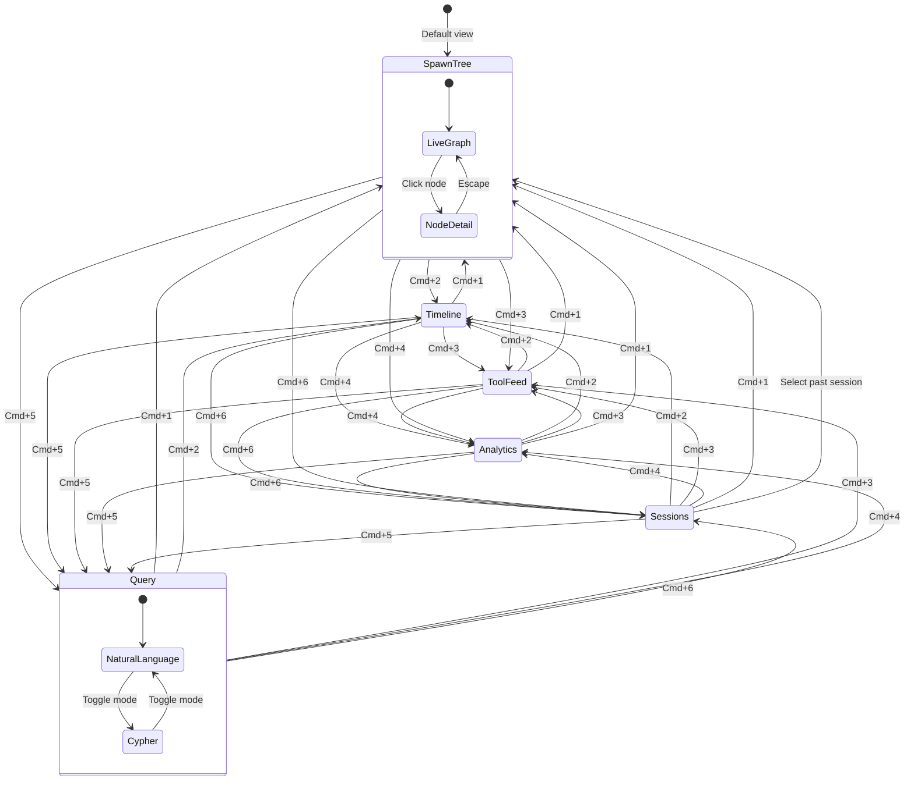
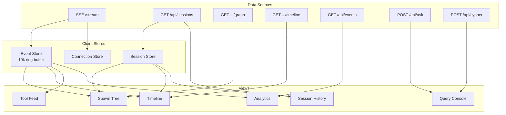

# UX & Dashboard

## Overview

Local-only, read-only, real-time monitoring at `http://localhost:3000`. Six views, each answering a different question about agent execution. Runs as a companion to your terminal.

## Data Flow

All views consume SSE (real-time push) and REST (on-demand fetch).

## View 1: Spawn Tree

**What agents are running and how are they related?**

Default view. Live directed graph via Cytoscape.js, dagre layout (top-to-bottom). Session node at root, agents as children connected by SPAWNED edges.

**Node states:**

| State | Fill | Text | Animation |
|---|---|---|---|
| Session root | Navy `#0D1B2A` | White | None (slightly larger) |
| Running agent | Teal `#0A9396` | White | Subtle 2s pulse on border |
| Complete agent | Dark gray `#1E293B` | Muted | None (faded) |
| Failed agent | Coral `#CA6702` | White | Brief flash, then static |

**Node sizing:** Proportional to tool call count (80px min, 160px max).

**Edges:** Directed arrows, teal `#0A9396`, 1.5px. Prompt text (first 40 chars) on hover.

**Interactions:**
- Click node to open detail panel (320px slide-in from right)
- Pan/zoom freely; auto-layout pauses on pan
- Reset button restores auto-layout
- Floating controls: zoom in/out/fit/reset
- Floating legend: node color meanings

**Detail panel:**
- Agent ID (monospace), type, status badge
- Start time (absolute + relative), duration (live counter if running)
- Spawned by (link to parent)
- Full prompt text (scrollable)
- Tools invoked (count + list with call counts)
- Skills loaded

## View 2: Timeline (Gantt)

**How long has each agent been running? Where are the bottlenecks?**

Horizontal bars on a shared time axis. Parallelism and sequential bottlenecks immediately visible.

**Layout:**
- Left column (200px): agent labels, indented 16px per spawn depth
- Right: scrollable Gantt canvas with shared time axis
- Rows: 32px tall, 4px gap
- Time axis auto-scales (1s, 5s, 30s, 1m, 5m)
- Current time: thin teal vertical line at right edge, moves live

**Bar colors:** Running = teal (right edge animated), Complete = dark gray, Failed = coral with X icon.

**Tool markers:** 2px x 12px ticks on each bar. Teal for success, coral for failure. Hover shows tool name, duration, input summary.

## View 3: Tool Feed

**What tool calls are happening right now?**

Reverse-chronological event log filtered to `PreToolUse`, `PostToolUse`, `PostToolUseFailure`.

**Event row (48px collapsed):**
- 4px colored left border (teal = Pre, green = Post success, coral = Failure)
- Timestamp `HH:MM:SS.mmm` (monospace, muted)
- Event type pill (`PRE` / `POST` / `FAIL`)
- Tool name (bold), agent type (muted)
- Duration (right-aligned, PostToolUse only)
- Summary (first 60 chars of key input)

**Expanded row (click):**
- Full `tool_input` as syntax-highlighted JSON
- `tool_response` summary (500 char limit, "show more" link)
- Correlation IDs: `agent_id`, `session_id`, `tool_use_id`

**Filter bar:** Event type multi-select pills, tool name autocomplete, status filter. All filters live.

**Pause button:** Freezes scroll. Auto-pauses when you scroll up.

## View 4: Analytics

**What are the performance patterns?**

Aggregated metrics from DuckDB. Time range selector: 5m / 30m / 1h / Session / All.

**Stat cards (2x2 responsive grid):**

| Card | Value | Subtext |
|---|---|---|
| Total Events | Count | Delta vs previous period |
| Active Agents | Live count (green) | + completed today |
| Tool Success Rate | Percentage | >95% green, <80% red |
| Median Latency | p50 ms | p95 below |

**Tool latency chart:** Horizontal bars per tool. Bar = p50, extended = p95. Teal (<100ms), amber (100-500ms), coral (>500ms). Sorted worst-first.

**Event rate chart:** Stacked area, events per 10s bucket, broken down by type.

**Per-tool table:** Tool name, calls (success/fail), latency p50/p95. Sortable.

## View 5: Query Console

**Whatever you want to ask.**

Two modes: Natural Language and Cypher.

**Natural Language:**
- Text input with placeholder examples
- "Ask" button (`Cmd+Enter`)
- Generated Cypher in collapsible code block
- One-line explanation
- Example chips: "Which agents are running?", "Show spawn tree", "Failed tool calls?", "Most loaded skills?", "Slowest tool call?"

**Cypher:**
- Code editor with syntax highlighting
- Collapsible schema sidebar: node labels, relationship types, properties
- Direct execution via `POST /api/cypher`

**Results:**
- Tabular: sortable columns, copy-to-CSV
- Graph: mini Cytoscape.js canvas, same styling as Spawn Tree
- Empty: "No results" (not an error)
- History: last 20 queries in localStorage

## View 6: Session History

**What happened in past sessions?**

**Left panel (320px):** Session list, newest first.

Each item:
- Status dot: green (active), gray (completed)
- `cwd` (last path segment bold, full path below)
- Start time, duration, agent count, event count
- Active session: teal border, "LIVE" badge

**Session switching:** Click a past session, all five views switch to that session's data. Banner: "Viewing archived session — [session_id] [date]" with "Return to live" button. Past sessions show final state.

## Design System

### Color Palette

| Token | Hex | Usage |
|---|---|---|
| `--color-primary` | `#0A9396` | Teal — running, active, links |
| `--color-bg` | `#0D1B2A` | Navy — app background |
| `--color-surface` | `#1E293B` | Cards, panels, sidebars |
| `--color-surface-2` | `#2D3E50` | Inputs, code blocks, hover |
| `--color-success` | `#94D2BD` | Mint — completed, success |
| `--color-warning` | `#EE9B00` | Amber — medium latency, caution |
| `--color-error` | `#CA6702` | Coral — failed, errors |
| `--color-text` | `#F4F8FB` | Near-white — primary text |
| `--color-text-muted` | `#64748B` | Gray — secondary labels |
| `--color-border` | `#1E3A4A` | Subtle borders |

### Typography

| Element | Font / Size / Weight | Usage |
|---|---|---|
| Display | Inter 24px Bold | View titles, section headers |
| Label | Inter 14px Medium | Card labels, nav items, column headers |
| Body | Inter 13px Regular | Descriptions, panel text |
| Caption | Inter 11px Regular | Timestamps, metadata |
| Code | JetBrains Mono 12px | Cypher, JSON, IDs |
| Monospace data | JetBrains Mono 13px | `agent_id`, `tool_use_id`, `session_id` |

### Components

**Status Badge:**

| Variant | Visual | Size |
|---|---|---|
| Running | Teal bg, white text, pulsing dot | 20px |
| Complete | Gray bg, muted text, static dot | 20px |
| Failed | Coral bg, white text, X icon | 20px |
| Connected | Green dot (top bar only) | -- |
| Disconnected | Red dot (top bar only) | -- |

**Stat Card:** Label (11px muted, top) + value (32px bold, center) + delta (11px colored, bottom). 88px height, `--color-surface` background, `--radius-md` corners. No animation on value update.

**Event Row:** 48px collapsed, auto-height expanded (min 200px). 4px colored left border. 150ms ease-out expand animation. Expanded JSON: dark background, teal keys, amber strings, mint numbers.

### Layout

**Top bar (48px):**
- Left: CC Observer wordmark + version
- Center: active session (`session_id`, `cwd`, live elapsed)
- Right: connection status pill + agent count

**Left sidebar:**
- 200px expanded, 56px collapsed (icon only)
- 6 items: Spawn Tree, Timeline, Tool Feed, Analytics, Query, Sessions
- Active: teal left border + background tint
- Auto-collapses below 960px
- Badges: agent count on Spawn Tree, unread count on Tool Feed

### Keyboard Shortcuts

| Shortcut | Action |
|---|---|
| `Cmd+1` - `Cmd+6` | Switch views |
| `Cmd+Enter` | Submit query |
| `Escape` | Close panels, collapse rows |
| `Space` | Toggle pause (Tool Feed) |
| `/` | Focus query input |

### Responsive Behavior

| Breakpoint | Sidebar | Layout |
|---|---|---|
| < 900px | Icon-only (56px) | Stat cards 1 col, Gantt labels truncated |
| 900-1200px | Expanded (200px) | Stat cards 2x2, standard |
| > 1200px | Expanded (200px) | Stat cards 4 across, wider Spawn Tree |

### SSE Reconnection

Exponential backoff on disconnect (1s, 2s, 4s, 8s, max 30s). Top bar status pill shows reconnect attempt number. On reconnect, re-fetch session graph to fill gaps. After 5 failures, manual "Retry" button appears.

### Loading and Empty States

| State | Display |
|---|---|
| Connecting | Spinner + "Connecting to observer..." |
| No active session | "No active session. Run `/oc:start` in Claude Code." |
| Empty graph | Single Session node, "Waiting for agents..." |
| Query loading | Spinner in Ask button, skeleton rows |
| Query empty | "No results" |
| Disconnected | Red status, banner: "Reconnecting..." with attempt count |
