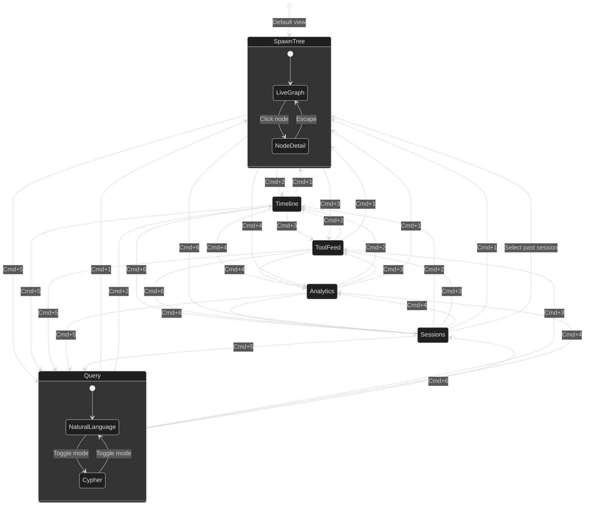
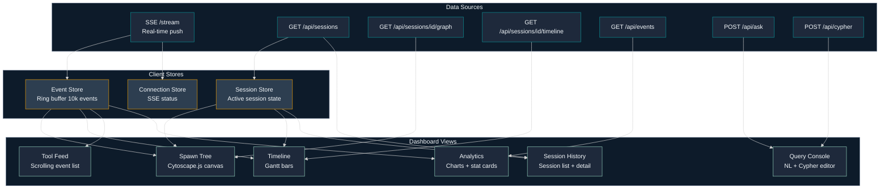

# UX & Dashboard Guide

## Overview

The CC Observer dashboard is a local-only, read-only, real-time monitoring tool. It runs at `http://localhost:3000` as a companion to the developer's terminal. Six views answer different questions about agent execution.

## Data Flow

All views consume data from two sources: the SSE stream (real-time push) and the REST API (on-demand fetch).

## View 1: Spawn Tree

**Question answered:** What agents are running and how are they related?

The default view. A live directed graph rendered with Cytoscape.js using dagre layout (top-to-bottom hierarchy). The session node is the root; agents are children connected by SPAWNED edges.

**Node states:**

| State | Fill | Text | Animation |
|---|---|---|---|
| Session root | Navy `#0D1B2A` | White | None (slightly larger) |
| Running agent | Teal `#0A9396` | White | Subtle 2s pulse on border |
| Complete agent | Dark gray `#1E293B` | Muted | None (faded) |
| Failed agent | Coral `#CA6702` | White | Brief flash, then static |

**Node sizing:** Proportional to number of tool calls (min 80px, max 160px width).

**Edge design:** Directed arrows, teal `#0A9396`, 1.5px uniform width. Prompt text (first 40 chars) shown on hover only.

**Interactions:**
- Click a node to open the detail panel (320px slide-in from right)
- Pan/zoom the canvas freely; auto-layout pauses when you pan
- Click "Reset" to restore auto-layout
- Floating controls: zoom in/out/fit/reset
- Floating legend: node color meanings

**Node detail panel:**
- Agent ID (full, monospace)
- Agent type, status badge
- Started time (absolute + relative)
- Duration (live counter if running)
- Spawned by (with link to parent)
- Full prompt text (scrollable)
- Tools invoked (count + list with call counts)
- Skills loaded (list)

## View 2: Timeline (Gantt)

**Question answered:** How long has each agent been running? Where are the bottlenecks?

Horizontal bars on a shared time axis. Makes parallelism and sequential bottlenecks immediately visible.

**Layout:**
- Left column (200px): agent labels, indented 16px per spawn depth
- Right area: scrollable Gantt canvas with shared time axis at top
- Each row is 32px tall with 4px gap
- Time axis auto-scales (1s, 5s, 30s, 1m, 5m intervals)
- Current time: thin teal vertical line at right edge, moves live

**Bar colors:**
- Running: teal fill, right edge animated (growing)
- Complete: dark gray fill
- Failed: coral fill with X icon at right end

**Tool call markers:** Small ticks on each bar (2px wide x 12px tall). Teal for success, coral for failure. Hover shows tool name, duration, and input summary.

## View 3: Tool Feed

**Question answered:** What tool calls are happening right now?

A scrolling reverse-chronological event log filtered to `PreToolUse`, `PostToolUse`, and `PostToolUseFailure` events.

**Event row (48px collapsed):**
- 4px colored left border (teal = Pre, green = Post success, coral = Failure)
- Timestamp (`HH:MM:SS.mmm`, monospace, muted)
- Event type pill (`PRE` / `POST` / `FAIL`)
- Tool name (bold)
- Agent type (muted)
- Duration (right-aligned, PostToolUse only)
- Summary line (first 60 chars of key input field)

**Expanded row (click to expand):**
- Full `tool_input` as syntax-highlighted JSON
- `tool_response` summary (truncated at 500 chars, "show more" link)
- Correlation IDs: `agent_id`, `session_id`, `tool_use_id`

**Filter bar:** Event type multi-select pills, tool name autocomplete, status filter. All filters apply live.

**Pause button:** Freezes scroll to let you read without new events pushing content. Auto-pauses when you scroll up.

## View 4: Analytics

**Question answered:** What are the performance patterns?

Aggregated metrics from DuckDB analytics queries. Time range selector: Last 5m / 30m / 1h / Session / All time.

**Stat cards (2x2 responsive grid):**

| Card | Value | Subtext |
|---|---|---|
| Total Events | Count | Delta vs previous period |
| Active Agents | Live count (green) | + completed today |
| Tool Success Rate | Percentage | Color: >95% green, <80% red |
| Median Tool Latency | p50 in ms | p95 in smaller text below |

**Tool latency chart:** Horizontal bars, one row per tool. Bar = p50, extended segment = p95. Color-coded: teal (<100ms), amber (100-500ms), coral (>500ms). Sorted worst-first.

**Event rate chart:** Stacked area chart of events per 10-second bucket over selected time range, broken down by event type.

**Per-tool table:** Tool name, calls (success/fail), latency p50/p95. Sortable columns.

## View 5: Query Console

**Question answered:** Whatever you want to ask.

Two modes: Natural Language and Cypher.

**Natural Language mode:**
- Text input with placeholder examples
- "Ask" button (keyboard: `Cmd+Enter`)
- Generated Cypher shown in collapsible code block with syntax highlighting
- One-line plain-English explanation
- Example query chips: "Which agents are currently running?", "Show me the spawn tree", "What tool calls failed?", "Which skills were loaded most often?", "What was the slowest tool call?"

**Cypher mode:**
- Code editor with Cypher syntax highlighting
- Collapsible schema sidebar showing all node labels, relationship types, and properties
- Direct execution via `POST /api/cypher`

**Results panel:**
- Tabular results: data table with sortable columns, copy-to-CSV button
- Graph results: mini Cytoscape.js canvas with same node styling as Spawn Tree
- Empty results: "No results" (not an error state)
- Query history: last 20 queries in localStorage, accessible via dropdown

## View 6: Session History

**Question answered:** What happened in past sessions?

**Left panel (320px):** Session list, sorted newest first.

Session list item:
- Status indicator: green dot (active), gray dot (completed)
- Primary text: `cwd` (last path segment bold, full path below)
- Metadata: start time, duration, agent count, event count
- Active session: teal left border, "LIVE" badge

**Session switching:** Clicking a past session switches all five other views to that session's data. A banner appears: "Viewing archived session — [session_id] [date]" with a "Return to live" button. Past sessions show final state (all agents complete).

## Design System

### Color Palette

| Token | Hex | Usage |
|---|---|---|
| `--color-primary` | `#0A9396` | Teal — running agents, active elements, links |
| `--color-bg` | `#0D1B2A` | Navy — app background |
| `--color-surface` | `#1E293B` | Cards, panels, sidebars |
| `--color-surface-2` | `#2D3E50` | Inputs, code blocks, hover states |
| `--color-success` | `#94D2BD` | Mint — completed agents, success states |
| `--color-warning` | `#EE9B00` | Amber — medium latency, caution |
| `--color-error` | `#CA6702` | Coral — failed agents/tools, errors |
| `--color-text` | `#F4F8FB` | Near-white — primary text |
| `--color-text-muted` | `#64748B` | Gray — secondary labels, timestamps |
| `--color-border` | `#1E3A4A` | Subtle borders between panels |

### Typography

| Element | Font / Size / Weight | Usage |
|---|---|---|
| Display | Inter 24px Bold | View titles, section headers |
| Label | Inter 14px Medium | Card labels, nav items, column headers |
| Body | Inter 13px Regular | Event descriptions, panel text |
| Caption | Inter 11px Regular | Timestamps, metadata, muted info |
| Code | JetBrains Mono 12px | Cypher queries, JSON payloads, IDs |
| Monospace data | JetBrains Mono 13px | `agent_id`, `tool_use_id`, `session_id` |

### Component Reference

**Status Badge:**

| Variant | Visual | Size |
|---|---|---|
| Running | Teal bg, white text, pulsing dot | 20px height |
| Complete | Gray bg, muted text, static dot | 20px height |
| Failed | Coral bg, white text, X icon | 20px height |
| Connected | Green dot (top bar only) | — |
| Disconnected | Red dot (top bar only) | — |

**Stat Card:** Label (11px muted, top) + large value (32px bold, center) + delta (11px colored, bottom). Height 88px, `--color-surface` background, `--radius-md` corners. Value updates in place with no animation.

**Event Row:** 48px collapsed, auto-height expanded (min 200px). 4px colored left border. Click toggles expansion with 150ms ease-out height animation. Expanded JSON uses dark background with teal keys, amber strings, mint numbers.

### Layout

**Persistent top bar (48px):**
- Left: CC Observer wordmark + version
- Center: active session (`session_id`, `cwd`, live elapsed time counter)
- Right: connection status pill + agent count badge

**Left sidebar:**
- 200px expanded, 56px collapsed (icon only)
- 6 items: Spawn Tree, Timeline, Tool Feed, Analytics, Query, Sessions
- Active: teal left border + background tint
- Auto-collapses to icon-only below 960px viewport width
- Badges: agent count on Spawn Tree, unread event count on Tool Feed

### Keyboard Shortcuts

| Shortcut | Action |
|---|---|
| `Cmd+1` through `Cmd+6` | Switch between views |
| `Cmd+Enter` | Submit query (Query Console) |
| `Escape` | Close slide-in panels, collapse expanded rows |
| `Space` | Toggle pause (Tool Feed) |
| `/` | Focus query input (Query Console) |

### Responsive Behavior

| Breakpoint | Sidebar | Layout Changes |
|---|---|---|
| < 900px | Icon-only (56px) | Stat cards 1 column, Gantt labels truncated |
| 900–1200px | Expanded (200px) | Stat cards 2x2, standard layout |
| > 1200px | Expanded (200px) | Stat cards 4 across, Spawn Tree panel wider |

### SSE Reconnection

On disconnect, the dashboard retries with exponential backoff (1s, 2s, 4s, 8s, max 30s). The top bar status pill updates with the reconnect attempt number. On successful reconnect, the client re-fetches the current session graph to fill any missed events. After 5 failed attempts, a manual "Retry" button appears.

### Loading and Empty States

| State | Display |
|---|---|
| Connecting | Centered spinner + "Connecting to observer..." |
| No active session | "No active session. Run `/oc:start` in Claude Code." |
| Empty graph | Single Session node, label "Waiting for agents..." |
| Query loading | Spinner in Ask button, skeleton rows in results |
| Query empty | "No results" (plain text, not error) |
| Disconnected | Red status in top bar, banner: "Reconnecting..." with attempt count |
