# Product Vision

## The Problem

Claude Code is a black box. When you run a complex task, agents spawn sub-agents, tools fire in parallel, skills load silently, and failures happen deep in the call tree. You see the final output — or the error — but you have no visibility into what happened between your prompt and the result.

This creates real problems:

- **Debugging is guesswork.** When something fails three agents deep in a spawn tree, you don't know which agent failed, which tool call broke, or what the input was.
- **Performance is invisible.** You can't tell if a task is slow because of a specific tool call, because too many agents spawned, or because one agent is stuck.
- **Agent behavior is opaque.** You don't know which skills loaded, what prompts spawned sub-agents, or how deep the execution tree grew.
- **Session history is lost.** Once a session ends, all structural information about what happened disappears.

## The Solution

CC Observer captures every lifecycle event that Claude Code emits and builds a real-time execution graph. The graph is queryable, visualizable, and persistent.

```mermaid
sequenceDiagram
    participant Dev as Developer
    participant CC as Claude Code
    participant Obs as CC Observer
    participant Dash as Dashboard

    rect rgb(13, 27, 42)
        Note over Dev,Dash: Without CC Observer
        Dev->>CC: Complex task prompt
        CC-->>Dev: ... long wait ...
        CC-->>Dev: Final output (or error)
        Note right of Dev: No idea what happened<br/>in between
    end

    rect rgb(10, 147, 150)
        Note over Dev,Dash: With CC Observer
        Dev->>CC: Complex task prompt
        CC->>Obs: SessionStart
        CC->>Obs: SubagentStart (planner)
        CC->>Obs: PreToolUse (Read)
        Obs->>Dash: SSE: new agent node
        CC->>Obs: PostToolUse (Read, 45ms)
        CC->>Obs: SubagentStart (implementer)
        Obs->>Dash: SSE: spawn edge, tool tick
        CC->>Obs: PreToolUse (Write)
        CC->>Obs: PostToolUseFailure (Write)
        Obs->>Dash: SSE: failure highlight
        Note right of Dev: Full visibility:<br/>graph, timeline,<br/>tool feed, analytics
        CC-->>Dev: Final output
    end
```

## Target User

A developer running Claude Code locally. Single user, single machine.

- Uses Claude Code for complex multi-step tasks where agents spawn sub-agents
- Wants to understand what's happening during long-running sessions
- Needs to debug failures and identify performance bottlenecks
- Runs the dashboard as a companion window (split screen or second monitor)
- The dashboard is peripheral, not primary focus — it's a monitoring tool, not a control panel

## Design Principles

### Read-only observation

CC Observer watches. It never controls, pauses, or modifies Claude Code execution. There are no buttons that cause side effects. The dashboard is a window, not a cockpit.

### Local-only, private by default

All data stays on your machine. Hook payloads may contain sensitive code, file paths, and tool outputs. Nothing leaves localhost. No telemetry, no cloud sync, no external dependencies (except the Anthropic API for NL-to-Cypher, which sends only the user's question, not session data).

### Zero configuration

`docker compose up` and it works. No config files to edit, no databases to provision, no ports to configure. The Claude Code plugin hooks handle event capture automatically. The collector self-initializes DuckDB and LadybugDB on first event.

### Failure is prominent

The most important information in an execution graph is what went wrong. Failed tool calls, crashed agents, and slow operations are visually highlighted in every view. You should be able to spot problems at a glance from across the room.

### Information density over decoration

This is a developer tool. Every pixel should carry information. Dark theme (the developer is already in a terminal), dense layouts, monospace data, and no decorative elements. The Spawn Tree is not a pretty visualization — it's a diagnostic instrument.

## What CC Observer Is Not

- **Not a log viewer.** Logs are text streams. CC Observer builds structured graphs with topology, timing, and relationships.
- **Not an APM tool.** No distributed tracing, no service meshes, no cloud infrastructure. This is a local developer tool for a local agent runtime.
- **Not a control plane.** You cannot start, stop, or modify agents from the dashboard. Read-only, always.
- **Not a replacement for Claude Code's output.** CC Observer shows *how* Claude Code is working, not *what* it's producing.
