# Product Vision

## The Problem

Claude Code is a black box. Agents spawn sub-agents, tools fire in parallel, skills load silently, failures happen deep in the call tree. You see the final output — or the error — but nothing in between.

Real problems fall out of this:

- **Debugging is guesswork.** Something fails three agents deep. Which agent? Which tool call? What was the input? No way to know.
- **Performance is invisible.** Slow because of a tool call? Too many agents? One stuck agent? Can't tell.
- **Agent behavior is opaque.** Which skills loaded? What prompts spawned sub-agents? How deep did the tree grow?
- **Session history is gone.** Session ends, structural information vanishes.

## The Solution

CC Observer captures every lifecycle event Claude Code emits and builds a real-time execution graph. Queryable, visualizable, persistent.

```mermaid
sequenceDiagram
    participant Dev as Developer
    participant CC as Claude Code
    participant Obs as CC Observer
    participant Dash as Dashboard

    rect rgb(13, 27, 42)
        Note over Dev,Dash: Without CC Observer
        Dev->>CC: Complex task prompt
        CC-->>Dev: ... long wait ...
        CC-->>Dev: Final output (or error)
        Note right of Dev: No idea what happened
    end

    rect rgb(10, 147, 150)
        Note over Dev,Dash: With CC Observer
        Dev->>CC: Complex task prompt
        CC->>Obs: SessionStart
        CC->>Obs: SubagentStart (planner)
        CC->>Obs: PreToolUse (Read)
        Obs->>Dash: SSE: new agent node
        CC->>Obs: PostToolUse (Read, 45ms)
        CC->>Obs: SubagentStart (implementer)
        Obs->>Dash: SSE: spawn edge, tool tick
        CC->>Obs: PreToolUse (Write)
        CC->>Obs: PostToolUseFailure (Write)
        Obs->>Dash: SSE: failure highlight
        Note right of Dev: Full visibility
        CC-->>Dev: Final output
    end
```

## Target User

A developer running Claude Code locally. Single user, single machine.

- Complex multi-step tasks where agents spawn sub-agents
- Wants to understand what's happening during long-running sessions
- Needs to debug failures and spot performance bottlenecks
- Runs the dashboard as a companion window — split screen or second monitor
- The dashboard is peripheral, not primary focus. Monitoring tool, not control panel.

## Design Principles

### Read-only observation

CC Observer watches. It never controls, pauses, or modifies Claude Code execution. No buttons cause side effects. The dashboard is a window, not a cockpit.

### Local-only, private by default

All data stays on your machine. Hook payloads contain code, file paths, tool outputs. Nothing leaves localhost. No telemetry, no cloud sync. The one exception: NL-to-Cypher sends only your question to the Anthropic API, never session data.

### Zero configuration

`docker compose up` and it works. No config files, no databases to provision, no ports to configure. The plugin hooks handle event capture automatically. The collector self-initializes DuckDB and LadybugDB on first event.

### Failure is prominent

The most important information in an execution graph is what went wrong. Failed tool calls, crashed agents, slow operations — visually highlighted in every view. You should spot problems at a glance from across the room.

### Information density over decoration

Developer tool. Every pixel carries information. Dark theme (you're already in a terminal), dense layouts, monospace data, no decorative elements. The Spawn Tree is a diagnostic instrument, not a pretty visualization.

## What CC Observer Is Not

- **Not a log viewer.** Logs are text streams. CC Observer builds structured graphs with topology, timing, and relationships.
- **Not an APM tool.** No distributed tracing, no service meshes, no cloud infrastructure. Local developer tool for a local agent runtime.
- **Not a control plane.** You cannot start, stop, or modify agents from the dashboard. Read-only, always.
- **Not a replacement for Claude Code's output.** CC Observer shows *how* Claude Code is working, not *what* it's producing.
